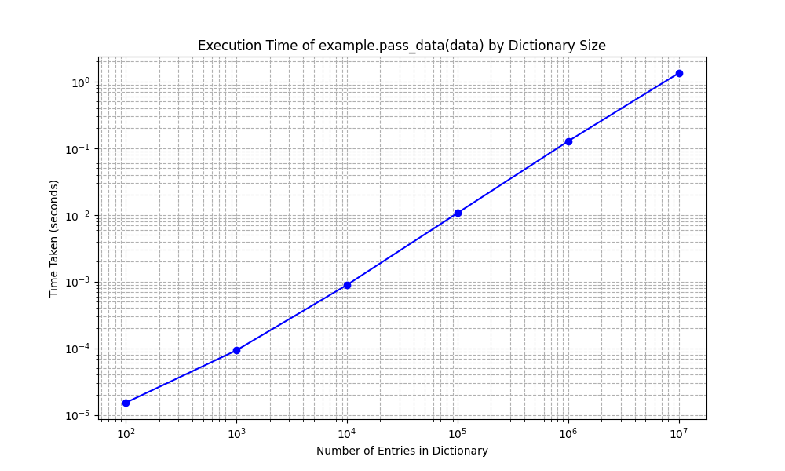
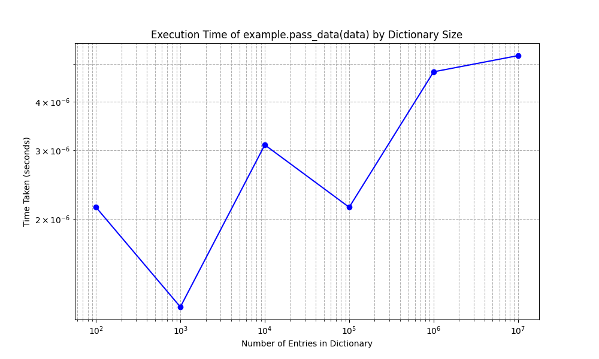

When we have a Python side `dict` object, its keys and values are all Python objects. When we pass and convert it to C++ using `pybind11`, it is essentially copied into a new temp object every time.

See  for example. Just the argument passing time scales with the number of elements.

A better way would be to implement a C++ class and expose it to Python.

See  for example. Argument passing itself takes almost no time.
